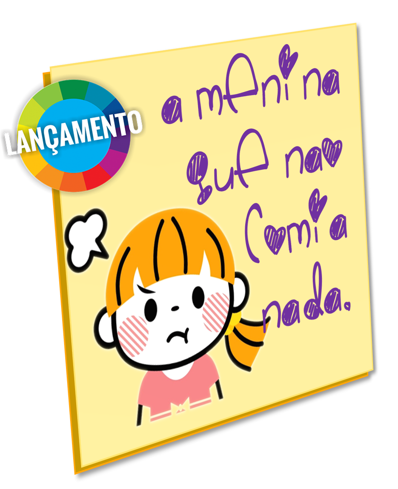

import ReactPlayer from 'react-player/youtube'

:::caution &nbsp;Importante
Para **adquirir** a versão impresso do livro A MENINA QUE NÃO COMIA NADA entre em contato com a gente pelo equipe.aprender.digital@gmail.com.  
:::

## Transcrição da história
Era uma vez uma menina **magra** que não comia nada.  
Olhava o prato e de tudo reclamava. 
Recebeu um prato com salada, batata, carne, arroz e feijão.  
Na na ni na nāo. **SALADA**? Eu não como não!

Mas era uma menina **enjoada** que não comia nada.  
Olhava o prato e de tudo reclamava. 
Recebeu um prato com batata, carne, arroz e feijão.  
Na na ni na não. **BATATA**? Eu não como não!

Era uma menina **mimada** que não comia nada.  
Olhava o prato e de tudo reclamava. 
Recebeu um prato com carne, arroz e feijão.  
Na na ni na não. **CARNE**? Eu não como não!

Mas como era uma menina **emburrada** que não comia nada.  
Olhava o prato e de tudo reclamava. 
Recebeu um prato com arroz e feijão.  
Na na ni na não. **ARROZ** e **FEIJÃO**? Eu não como não!

&#60;&#60;Roooooooooonc!!!&#62;&#62;

Acho que vou experimentar...
&#60;&#60;salada&#62;&#62; &#60;&#60;batata&#62;&#62; &#60;&#60;carne&#62;&#62; &#60;&#60;arroz e feijão&#62;&#62;

Era uma menina **esfomeada**. Olhava o prato e tudo experimentava. 
Recebeu um prato com **ARROZ** e **FEIJÃO**.  
Na na ni na não. Só com **arroz** e **feijão** a minha fome não acaba, não!

Era uma menina **animada**. Olhava o prato e tudo experimentava. 
Recebeu um prato com **CARNE**, arroz e feijão.  
Na na ni na não. Só com **carne**, arroz e feijão a minha fome não acaba, não!

Mas era uma menina **antenada**. Olhava o prato e tudo experimentava. 
Recebeu um prato com **BATATA**, carne, arroz e feijão.  
Na na ni na não. Só com **batata**, carne, arroz e feijão a minha fome não acaba não!

Era uma menina **arretada**. Olhava o prato e tudo experimentava. 
Recebeu um prato com **SALADA**, batata, carne, arroz e feijão.

&#60;&#60;Nhac, nhac, nhac, nhac e nhac.&#62;&#62;

Era uma menina **alimentada**. Olhava o prato e tudo experimentava. 
Comeu um prato com salada, batata, carne, arroz e feijão...

&#60;&#60;BUUUUUURPS!!!&#62;&#62;

Ops! Da próxima vez eu não como tão rápido não!

## Contação de histórias
Neste vídeo a educadora Nicione Castelo (Nicinha) conta a história A MENINA QUE NÃO COMIA NADA. Conte você mesmo a história ou use este vídeo com seus alunos.

<ReactPlayer url='https://www.youtube.com/watch?v=siT_c9SiG_I' controls={true} width='100%' />

