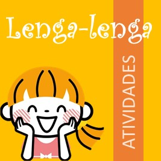

## Bem-vindo
Em um contexto em que o hábito da leitura tem perdido espaço para estímulos rápidos e digitais, é fundamental criar experiências significativas que despertem o prazer de ler.

Foi com esse propósito que estruturei o projeto *Lenga-lengas*, partindo de uma pergunta provocadora: e se os alunos pudessem criar suas próprias histórias como ponto de partida para se aproximarem da literatura?

Sim — escrever para querer ler. Escrever para entrar no mundo dos livros como quem descobre que também pode habitá-lo.

Quando uma criança escreve a sua própria história, algo especial acontece: ela se reconhece como autora, percebe que tem voz, que suas experiências importam — e isso cria uma conexão profunda com o mundo da leitura.

Muitas vezes, ao escrever, a criança sente necessidade de reler, buscar modelos, descobrir “como os autores fazem”. E assim, naturalmente, ela se aproxima dos livros com um novo olhar: o de quem pertence a esse universo.

Estudos mostram que a escrita pessoal, quando bem mediada, fortalece a identidade leitora, amplia o repertório linguístico e desenvolve o gosto pela leitura de forma afetiva e significativa. Escrever histórias próprias é uma forma de ler o mundo — e de querer ler mais.

Claro que essa não é a única estratégia possível. O encantamento com a leitura também nasce de histórias lidas em voz alta com emoção, de rodas de conversa sobre personagens, de livros que circulam com liberdade e afeto pela sala de aula.

Mas a ideia de tornar o aluno autor traz uma potência que não pode ser ignorada: ela gera pertencimento. E talvez esse seja um dos maiores convites à leitura — quando a criança entende que os livros também falam dela, e que ela também pode falar com os livros.

Portanto, boas-vindas ao guia **Atividades usando LENGA-LENGAS**. Você está lendo a segunda versão deste material — uma atualização da versão original, elaborada para a 6ª edição do projeto Dia Nacional do Livro Infantil (#DNLI6).
