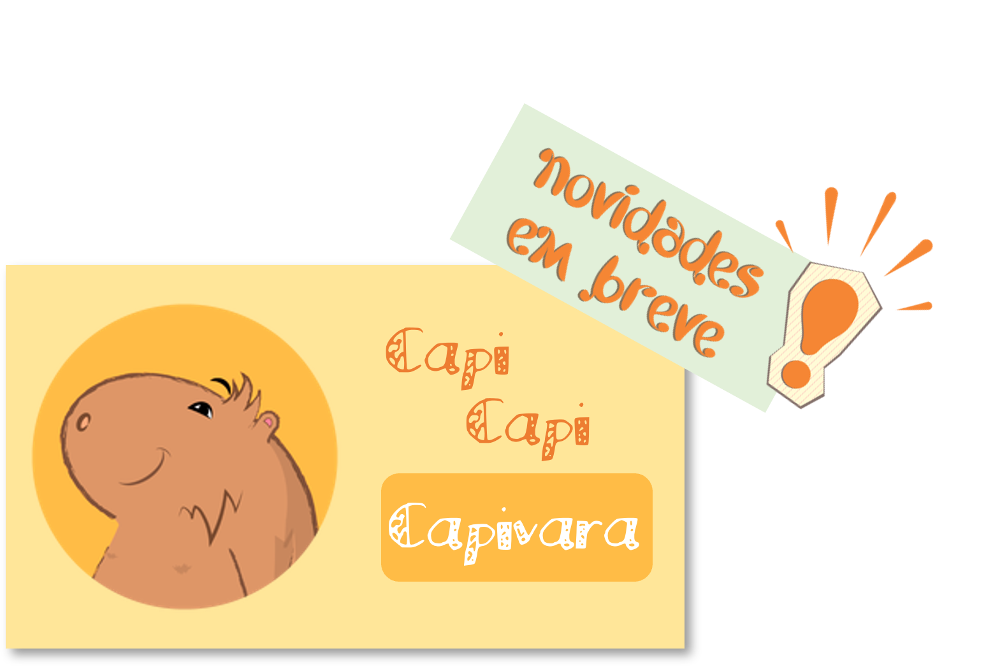

**Dez** capivaras caminhavam no parque apreciando o sol da manhã. 
Sacode, sacode e **sacode**. Uma entrou na água e então sobraram **9**.

**Nove** capivaras caminhavam no parque apreciando o sol da manhã.
Um ciclista muito **afoito**, assustou uma delas e então sobraram **8**.

**Oito** capivaras caminhavam no parque apreciando o sol da manhã.
Uma delas pensou. Tenho que arrumar o meu **topete**. Foi embora e então sobraram **7**.

**Sete** capivaras caminhavam no parque apreciando o sol da manhã. 
Duas delas eram **bebês**. Uma foi procurar a mãe e então sobraram **6**.

**Seis** capivaras caminhavam no parque apreciando o sol da manhã.
O quê? Um **ornitorrinco**! Uma foi atrás e então sobraram **5**.

**Cinco** capivaras caminhavam no parque apreciando o sol da manhã.
Mas que passeio **chato**! Foi embora e então sobraram **4**.

**Quatro** capivaras caminhavam no parque apreciando o sol da manhã. 
Lembra que no início eram dois **bebês**? Pode contar outra vez! O segundo já se foi e então sobraram **3**.

**Três** capivaras caminhavam no parque apreciando o sol da manhã. 
Uma parou e resolveu ficar 
na **sua**. Foi assim que só sobraram **duas**.

**Duas** capivaras caminhavam no parque apreciando o sol da manhã. 
Na capivara um passarinho pousou como uma **pluma**. 
A dona capi gostou e no passeio só sobrou **uma**.

Capivara em tupi-guarani significa “**comedora de capim**”. 
Eu aproveito esta deixa para dizer que o passeio chegou ao **fim**.