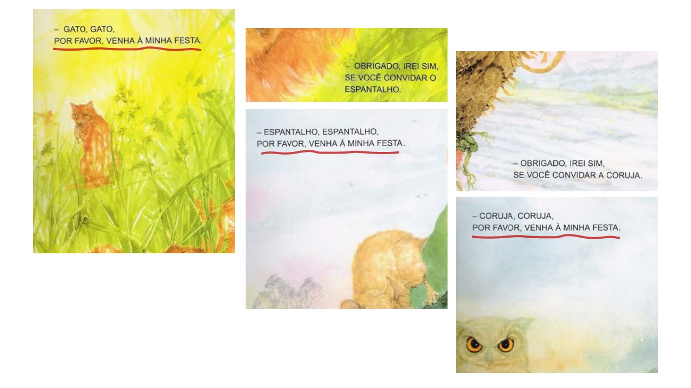

import ReactPlayer from 'react-player/youtube'

## Lenga-lenga
No dicionário encontramos a definição de **lenga-lenga** como sendo algo *extenso, entediante, enfadonho* ou mesmo como *enrolação*.

No contexto deste livro, **lenga-lenga** é um texto que usa e abusa das rimas e das repetições. Esta característica atrai as crianças menores, pois durante uma contação de história ou leitura, as crianças são capazes de antecipar os acontecimentos.

A repetição e as rimas, características de uma lenga-lenga, favorecem a compreensão e a memorização, facilitando uma leitura autônoma.

Observe no vídeo do grupo **Tiqueqê** 👇 o que poderia chamar de *um clássico* da lenga-lenga. 😉

<ReactPlayer url='https://www.youtube.com/watch?v=DyEq-BL32tY' controls={true} width='100%' />

 
Classificação é sempre algo que gera divergências, mas para ajudar na compreensão, agrupamos as lenga-lengas nos seguintes tipos:

 * Históricas circulares ou sem fim
 * Histórias com repetição
 * Histórias com acumulação
 * Tangolomangos
 * Mistos

## Circulares ou sem fim
Veja um exemplo da autora Regina Pamplona. 👇

<h2>
“Era uma vez um rei  
sentado no sofá  
que pediu para a sua babá  
que contasse uma história.  
A história começou:  
Era uma vez um rei  
sentado no sofá... ”  
</h2>
<small>Livro "Era uma vez... três: histórias de enrolar", de Regina Pamplona</small>

 

Agora, outro exemplo de história circular, esta contada por Laruama Alves e Élcio Rodrigues em episódio do Quintal da Cultura.

<ReactPlayer url='https://www.youtube.com/watch?v=LOMytltxLLQ' controls={true} width='100%' />

## Repetição
Os livros abaixo são exemplos de histórias **com repetição**.
  * **Os bichos também sonham** 
    de Andrea Daher, Zaven Paré. WMF
  * **Bruxa, Bruxa, venha à minha festa** 
    de Arden Druce, ilustrado por Pat Ludlow São Paulo: Brinque-Book Editora, 1995.
  * **O rei Bigodeira e sua banheira** 
    de Audrey Wood, ilustrado por Don Wood São Paulo: Editora Ática, 2006.

Observe na imagem 👇 a **repetição** no *Bruxa, Bruxa venha à minha festa*.

## Acumulação
Neste tipo de história surgem (ou se acumulam) personagens que buscam resolver o problema desencadeado pela narrativa.

Dois exemplos de livros com a estrutura de repetição acumulativa.
  * **E o dente ainda doía** 
    de Ana Terra, Editora Dcl.
  * **A casa sonolenta** 
    de Audrey Wood, ilustrado por Don Wood.
    São Paulo: Editora Ática, 2005.

## Tangolomangos
História em que os personagens vão diminuindo devido aos eventos desencadeados pela narrativa.

Um tangolomango muito difundido é o das **Nove irmãs**. Encontramos registros deste tangolomango com variações. Abaixo a versão cantada pela Bia Bedran e [gravado no Teatro Municial de Niterói](https://www.youtube.com/watch?v=4zn8pN1jv9Y).

<h4>

Eram nove irmãs numa casa, uma foi fazer biscoito. 
Deu tangolomango nela e das nove ficaram oito.

Eram oito irmãs numa casa, uma foi amolar canivete. 
Deu tangolomango nela e das oito ficaram sete.

Eram sete irmãs numa casa, uma foi falar inglês. 
Deu tangolomango nela e das sete ficaram seis.

Eram seis irmãs numa casa, uma foi caçar um pinto. 
Deu tangolomango nela e das seis ficaram cinco.

Eram cinco irmãs numa casa, uma foi fazer teatro. 
Deu tangolomango nela e das cinco ficaram quatro.

Eram quatro irmãs numa casa, uma foi falar francês. 
Deu tangolomango nela e das quatro ficaram três.

Eram três irmãs numa casa, uma foi andar nas ruas. 
Deu tangolomango nela e das três ficaram duas.

Eram duas irmãs numa casa, uma foi fazer coisa alguma. 
Deu tangolomango nela e das duas ficou só uma.

Era uma irmã numa casa, e ela foi fazer feijão. 
Deu tangolomango nela e acabou a geração.
</h4>

 

É possível encontrar variações inspiradas no tangolomango das **Nove irmãs** como este aqui gravado pela Mariane Bigio (parceria e Milla Bigio e Diego Santos) que propõe um *"final feliz"*. 🙂 É o [tangolomango dos **coelinhos**](https://youtu.be/fqEPQe4aqmE). O livro **Chá das dez** escrito por Celso Sisto também se inspira nos tangolomangos, mas também se preocupa em proporcionar um *final feliz*. 

## Mistos
Não é bem uma classificação, mas as repetições, rimas, acumulações ou desacumulações (estilo tangolomango) servem de inspiração para histórias escritas ou cantadas. O recurso pode caracterizar todo o conto, por exemplo, ou inspirar apenas uma parte dele.

Para comemorar o Dia Nacional do Livro Infatil deste ano (2021) resolvi me aventurar nas lenga-lengas e produzi estes **dois livros**. 👇 Desta vez, buscando uma imersão completa, 😱 eu mesmo escrevi, ilustrei e diagramei os livros. São eles:

  * [A menina que não comia nada](amenina).
  * [Capi, capi, capivara](capivara).
 